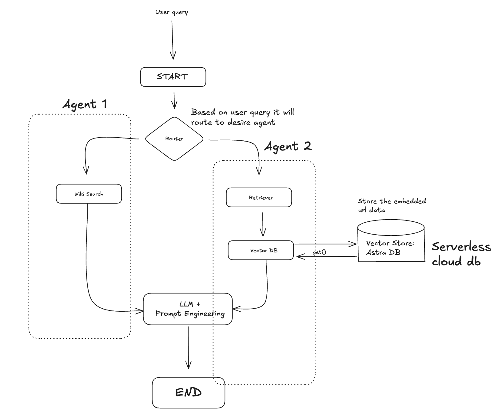

# Multi-Agent Question Answering System with LangGraph

It's a multi-agent system that answers questions by routing queries to the most appropriate knowledge source: either a vector database containing LangChain documentation or Wikipedia for general knowledge questions.

# Flow of Multi Agent

## System Overview

The system uses a LangGraph workflow to create a decision tree that:

1. Receives a user question
2. Routes it to the most appropriate data source
3. Retrieves relevant information
4. Returns the results

## Key Components

### Agent 1: Vector Database Retriever

- **Purpose**: Answers questions about LangChain concepts
- **Implementation**:
  - Uses Astra DB as a vector database
  - Documents from LangChain websites are split into 500-token chunks
  - Embeddings are created using HuggingFace's "all-MiniLM-L6-v2" model
  - Stored in Astra DB in a table named "multi_agent"
  - Retrieved using a retriever interface for semantic search

### Agent 2: Wikipedia Search

- **Purpose**: Answers general knowledge questions
- **Implementation**:
  - Uses `WikipediaAPIWrapper` to interface with the Wikipedia API
  - Configured to return the top 2 most relevant results
  - Results are limited to 200 characters per article for conciseness

### Router Agent

- **Purpose**: Determines which knowledge source to use for each question
- **Implementation**:
  - Uses a Groq LLM with the llama3-8b-8192 model
  - Structured output using Pydantic models ensures consistent decisions
  - System prompt instructs the LLM on routing logic:
    - LangChain questions → Vector Database
    - General knowledge questions → Wikipedia

## Data Flow

1. **Question Input**: User submits a question
2. **Routing**: The `route_question` function:
   - Extracts the question from the state
   - Uses the question_router to determine the appropriate data source
   - Returns either "vectorstore" or "wiki_search" as the next node
3. **Retrieval**:
   - If routed to "vectorstore": the `retrieve` function queries the vector database
   - If routed to "wiki_search": the `wiki_search` function queries Wikipedia
4. **Output**: The retrieved documents are returned as the final state

## Why Use a Retriever for Vector DB?

We use a retriever interface to interact with the vector database because:

- It provides a standardized way to query vector stores
- It abstracts away the underlying vector database implementation
- It allows for easy swapping of vector stores
- It handles the similarity search operations efficiently

## Technical Implementation

### State Management

The system uses a `GraphState` TypedDict to manage and pass state between components:

- `question`: The user's original question
- `generation`: Space for the generated answer (future enhancement)
- `documents`: The retrieved documents

### Document Processing

- Documents are chunked using token-based splitting rather than character-based
- This ensures consistency across different languages and text types
- The tiktoken encoder aligns with how LLMs process text

